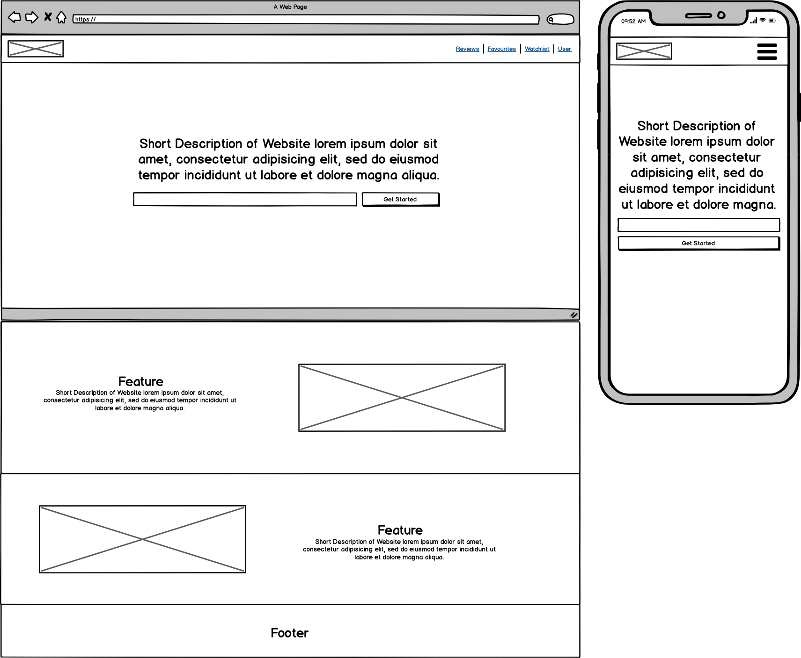
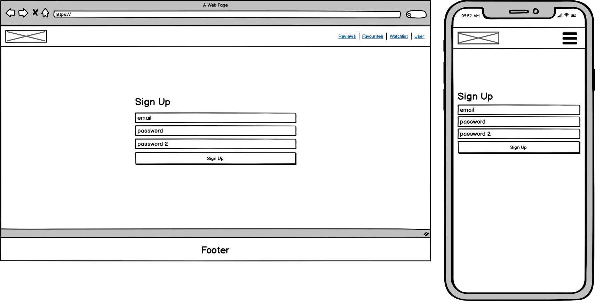
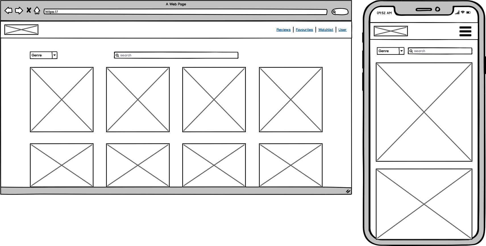
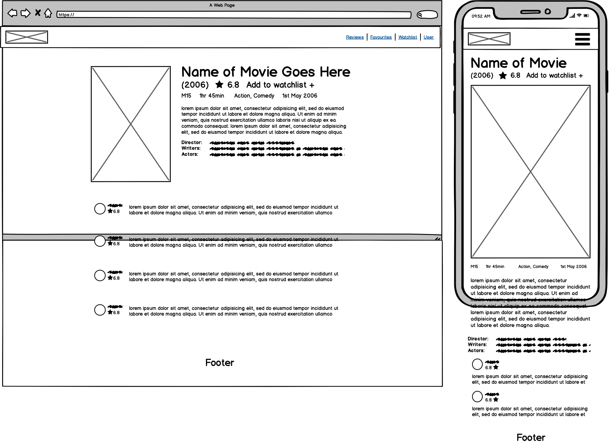
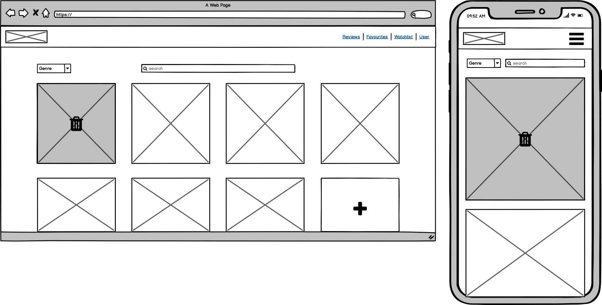

# T3_A2 Part 1 Documentation - iFlicks (working title)
## Jeremy W, Greg M, Hai H

## Application Outline
The purpose of this application is for users to view and search a large library of movies for the user to decide what to watch by viewing movie trailers, images, descriptions and user reviews, while also added social aspects by users being able to create a user profile that will display user information, their movie reviews and movie playlists.

### Functionality/Features
### Users
Users will have the ability to create an account to gain full access to website functionality, which they must be logged in to do so. 
Users who are not logged in or have not created an account, they will be able to view the homepage and movie profile pages. 
Users with accounts, will be able to create profiles that will display profile information, e.g name, profile picture, description, user reviews and playlists. 
Account users will also be allowed to post reviews of movies that can be edited or deleted and can be viewed on the account users profile and on the movie profile. 
Users with accounts so be able to give a rating to a movie by a 5 star rating feature. Account users will be allowed to create movie playlists by either favoriting movies or create, add, edit and delete a custom playlists.  
### Search Bar
Users should be able to search for movies by name, genre, year, or rating.
### Movie Profile / Show Page
Movie profiles should display movie information, such as, title, description, movie poster, trailer, images, rating and user reviews.
### Additional Features
Friends system for other users to view your profile/ favourites/ playlists?
Or just site account users to be able to other users profiles

## Target audience
The app will attract anyone who wanted to have quick review of the movie they want to watch or just looking for recommendations of what movies they should watch base on their references. 

## User Persona
### Jacob
#### Details
Young, single or partnered. Loves to dig into tv series or good movie during the night time. Uses films to unwind after uni/school/work. Very active online, always looking for a movie online to watch.
#### Goals
Wants to be able to scroll easily through movies, with a visually clean ui that's easy to navigate, to save to watchlists and write reviews based on their viewing experience.
#### Characteristics 
- Age is 18-35
- Introverted, stays in during the weekend and rainy days
- Loves movies and Tv
- Trying to have one spot to find movies and shows and keep track of what has/hasn't watched
- Wants it centralised and easy to use

## User story
- As a site visitor, i want to be able to view all the top movies at the moment when i enter the site.
- As a site visitor, i want to be able to search or filter a specific movie by name, rating or category.
- As a site visitor, i want to be able to view all the comments about a specific movie. 
- As a site visitor, i want to be able to see the rating of a specific movie.
- As a user, i want to be able to view all the top movies when i enter the site, search, view comments, see the rating a specific movie.
- As a user, i want to be able to create watch lists. 
- As a user, i want to be able to add movies to my watch lists.
- As a user, i want to be able to remove movies out of my watch lists.
- As a user, i want the site to recommend me what movies is should watch base on my references.
- As a user, i don't want my watch lists to be modified by any other user.
- As a user, i want to be able to share my watch lists to other users.

### Target audience
The app will attract anyone who wanted to have quick review of the movie they want to watch or just looking for recommendations of what movies they should watch base on their references.

### Data flow diagram

### Application architecture diagram

## Tech Stack
### MERN Stack
#### MongoDB
MongoDB is a NoSQL database where each record is a document comprising of key-value pairs that are similar to JSON (JavaScript Object Notation) objects. MongoDB is flexible and allows its users to create schema, databases, tables, etc. Documents that are identifiable by a primary key make up the basic unit of MongoDB. Once MongoDB is installed, users can make use of Mongo shell as well. Mongo shell provides a JavaScript interface through which the users can interact and carry out operations (eg: querying, updating records, deleting records).

#### Express(.js)
Express is a Node.js framework. Rather than writing the code using Node.js and creating loads of Node modules, Express makes it simpler and easier to write the back-end code. Express helps in designing great web applications and APIs. Express supports many middlewares which makes the code shorter and easier to write.

#### React(.js)
React is a JavaScript framework built by FaceBook and is an incredibly simplistic yet powerful framework to build out interactive and dynamic UI's quickly. It works on simple components that connected together can create intricate user interfaces. These components can access data from the backend and render them as HTML. Minimal code and minimal pain is what you can expect from React, as well as speed and never having to refresh your page as all outgoing requests are handled right in the page with JavaScript.

#### Node.
Node is how we can connect our application to a web server, before it, using JavaScript in the back end to create a web server wasn't possible. The invention of node allowed JavaScript users to finally take the versatility of JavaScript and incorporate it throughout the whole of the development of a website or application.

### Other technologies
API: http://www.omdbapi.com/

### Wireframes
#### Splash Page

#### Sign Up Page

#### Homepage

#### Movie Page

#### Watchlist Page

